# Bank accounts and expenses

It is a demo django project that helps to keep expenses on bank accounts.

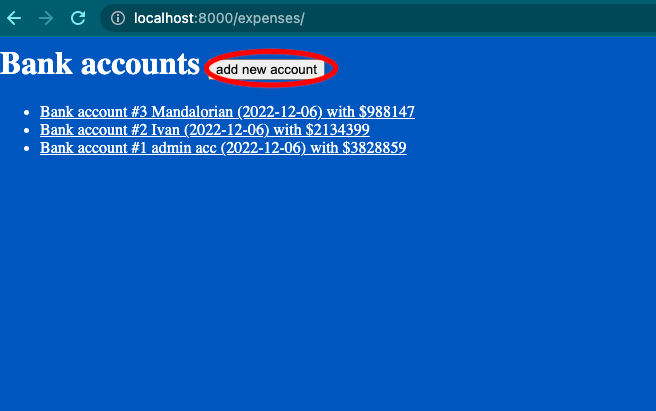

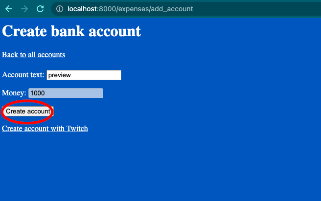

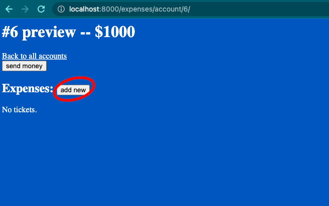

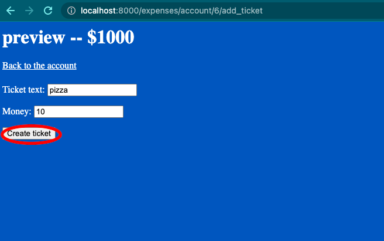

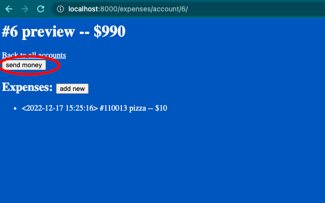

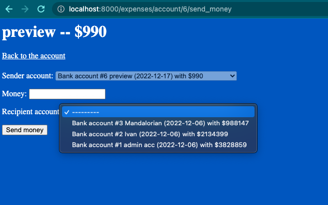


## What I learned:

### Django:
- object-relational mapper (ORM)
- views, generic views
- forms
- validators
- race conditions
- django testing
- django logging
- transactions
- custom admin  
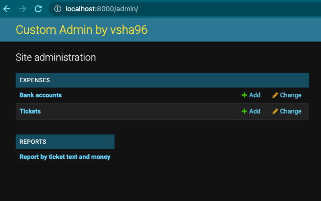
- reports  
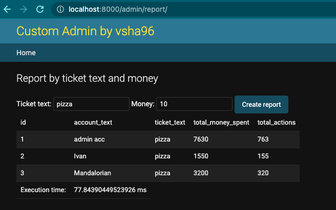  
- and more ...


### REST API:
- serializers, relations
- rest api views, viewsets
- permissions
- url filtering  
- and more ...  
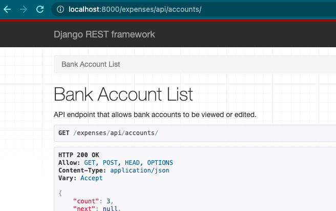
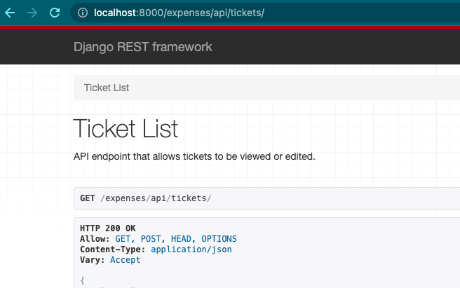


### PostgreSQL:
- transactions
- indexes
- reports
- full text search
- and more ...


### Logging:
- standard logging
- django logging with sql queries
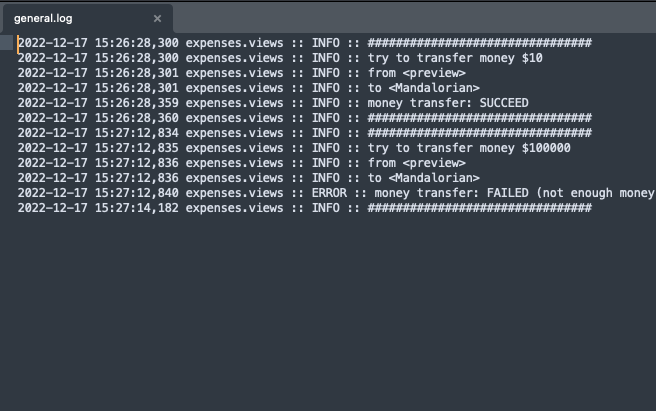
- Sentry  
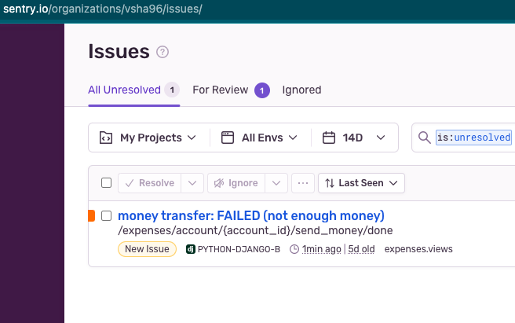


### OAuth:
- creating account with twitch  
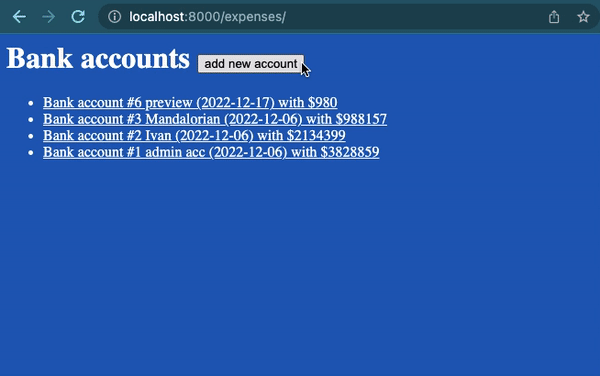

### Testing:
- unit testing
- unit tests for views with requests


## How to install:
- install [django](https://www.djangoproject.com/download/)  
- if needed, change database to sqlite in `edusite/settings.py` -> `DATABASES = { ... }`  
OR make postgresql database like in `edusite/settings.py` -> `DATABASES = { ... }`
- `python manage.py makemigrations`
- `python manage.py migrate`

## How to run:
- In the directory of project ```python manage.py runserver```
- Go to ```http://localhost:8000/expenses/``` in your browser
- `http://localhost:8000/admin/` user: `admin`; password: `admin`


