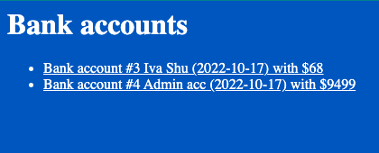
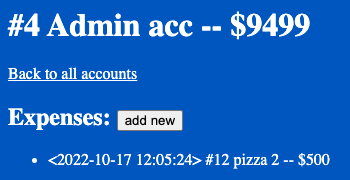

# Bank accounts and expenses

TODO update notes (there were lots of things)  
It is a simple django project that helps to keep expenses on bank accounts.

## How to run:
- `python manage.py runserver`
- open page in the browser `http://127.0.0.1:8000/expenses/`
- `http://127.0.0.1:8000/admin/` user: `admin`; password: `admin`


## What I learned:
- object-relational mapper
- views, generic views
- django testing
- forms
- validators
- avoiding race condition via F()

## How to run:
- In the directory of project ```python manage.py runserver```
- Go to ```http://localhost:8000/expenses/``` in your browser






